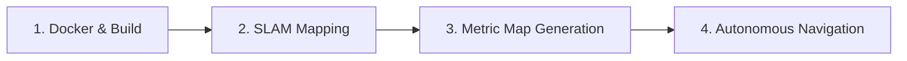

# G1Pilot: Simulation and Autonomous Mission Execution Guide

This manual details the step-by-step process of building the `g1pilot` package, performing environment SLAM mapping, converting SLAM maps to metric databases, and launching autonomous 2D navigation missions for the G1 humanoid robot in **`unitree_sim_isaaclab`**.

---

## General Workflow

The execution is structured into four main operational phases:


---

## Phase 1: Container Initialization and Building

To maintain absolute reproducibility, the workspace executes inside a pre-configured Docker container.

1. **Navigate to the docker directory and launch the container:**
   ```bash
   cd src/g1pilot/docker
   sh run.sh
   ```
   * *`run.sh` binds the local workspace to `/ros2_ws/src/g1pilot` inside the container and sets up CycloneDDS variables.*

2. **Build the `g1pilot` package inside the container:**
   ```bash
   ./cbuild g1pilot
   ```
   * *This uses a custom script to invoke `colcon` specifically for G1 modules.*

3. **Source the ROS 2 workspace environment:**
   ```bash
   source install/setup.bash
   ```

---

## Phase 2: Environment SLAM Mapping

With the `unitree_sim_isaaclab` simulator active in the background, we initialize the SLAM stack to map the environment.

1. **Launch the MOLA SLAM system:**
   ```bash
   ros2 launch g1pilot mola_launcher.launch.py use_rviz:=True generate_simplemap:=True
   ```
   
   > **Parameter breakdown:**
   > * `use_rviz:=True`: Opens RViz 2 to monitor the pointcloud mapping live.
   > * `generate_simplemap:=True`: Sets MOLA SLAM to accumulate keyframes and sensor paths to save a database file.

2. **Drive the robot** (using manual gait commands or joystick inputs) around the sandbox to fully explore and map the environment.

3. **Saving the Map:**  
   Once exploration is complete, terminate the mapping terminal with **`Ctrl + C`**.  
   * **Result:** MOLA will consolidate all data and automatically write a database file to:  
     `/ros2_ws/final_map.simplemap`

---

## Phase 3: Inspecting the SimpleMap

To verify the recorded SLAM database metadatas (e.g. keyframe count, sensor poses, database structures) and validate the file, execute:

```bash
sm-cli info /ros2_ws/final_map.simplemap
```
* *This MOLA tool displays summary details, verifying that the simplemap was generated successfully and is not corrupted.*

---

## Phase 4: Generating the Metric Map (`.mm`)

The raw `.simplemap` file is highly detailed but memory-heavy for direct navigation. We convert it into a streamlined, voxelized **Metric Map (`.mm`)** that acts as the global environment layout.

Run the metric generator utilizing our custom decimation pipeline:

```bash
/opt/ros/jazzy/bin/sm2mm \
  --input final_map.simplemap \
  --pipeline /ros2_ws/src/g1pilot/pipelines/sm2mm_pipeline.yaml \
  --output final_map.mm
```

> **What does the pipeline (`sm2mm_pipeline.yaml`) do?**
   > * Reads the accumulated SLAM point cloud keyframes.
   > * Performs voxel decimation at a resolution of `0.20m`, weeding out point clouds noise.
   > * Merges the optimized points into a voxel map layer (`HashedVoxelPointCloud`), generating a clean collision layout for G1.

---

## Phase 5: Visualizing the Metric Map

To double-check the compiled geometry of the environment prior to navigation, you can inspect the `.mm` file in 3D:

```bash
mm-viewer /ros2_ws/final_map.mm
```
* *A 3D OpenGL window will open, letting you pan and inspect the converted mesh.*

---

## Phase 6: Running Autonomous Navigation Missions

Once the metric map (`final_map.mm`) is ready, you can deploy autonomous goal-directed missions inside the simulator.

1. **Launch the master autonomous mission controller:**
   ```bash
   ros2 launch g1pilot mission_launcher.launch.py mola_map:=/ros2_ws/final_map.mm
   ```
   
   > **Parameter breakdown:**
   > * `mola_map:=/ros2_ws/final_map.mm`: Path to the voxelized metric map file.

2. **Under the Hood Pipeline:**
   * **MOLA Localization:** Dynamically tracks G1's position within the global metric map layout (`.mm`).
   * **3D-to-2D Projection:** The `pcl_to_grid` node converts the 3D local map points into a 2D `/map` Occupancy Grid in real time.
   * **Path Planning (Dijkstra):** The `dijkstra_planner` computes the shortest collision-free coordinate line from G1 to the goal.
   * **Trajectory Control:** `nav2point` and `loco_client` track the line and publish walking velocities directly to the Isaac Lab simulator via `/run_command/cmd`.

3. **Sending a Destination in RViz:**
   * Inside the RViz window, click the **2D Goal Pose** tool on the top toolbar (or press `G`).
   * Click and drag anywhere on the map to set the robot's target coordinates.
   * **Behavior:** The G1 humanoid will immediately calculate a path, visualize the inflated safety margins, and walk autocratically to the goal position.

---

## Command Summary (Cheat Sheet)

```bash
# Compile and Setup
cd src/g1pilot/docker && sh run.sh
./cbuild g1pilot && source install/setup.bash

# SLAM Mapping
ros2 launch g1pilot mola_launcher.launch.py use_rviz:=True generate_simplemap:=True

# Read Simplemap Info
sm-cli info /ros2_ws/final_map.simplemap

# Convert Simplemap to Metric Map
/opt/ros/jazzy/bin/sm2mm --input final_map.simplemap --pipeline /ros2_ws/src/g1pilot/pipelines/sm2mm_pipeline.yaml --output final_map.mm

# Visualize Metric Map
mm-viewer /ros2_ws/final_map.mm

# Run Autonomous Navigation
ros2 launch g1pilot mission_launcher.launch.py mola_map:=/ros2_ws/final_map.mm
```
