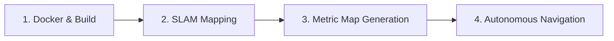

# G1Pilot: Simulation and Autonomous Mission Execution Guide

This manual details the step-by-step process of building the `g1pilot` package, performing environment SLAM mapping, converting SLAM maps to metric databases, and launching autonomous 2D navigation missions for the G1 humanoid robot in **`unitree_sim_isaaclab`**.

---

## General Workflow

The execution is structured into four main operational phases:


---

## Phase 1: Container Initialization and Building

To maintain absolute reproducibility, the workspace executes inside a pre-configured Docker container.

**If this repo is checked out as a submodule of the main simulation repo** (`industrial_hum`),
its own `docker-compose.yaml` already defines a `g1pilot` service that does everything below
automatically -- build, `cbuild g1pilot`, source the workspace, and `ros2 launch
mission_launcher.launch.py` -- and waits for the simulation (`g1` service) to finish spawning
and stabilizing before it starts. From the main repo's root:
```bash
docker compose up g1 g1pilot
```
See its own README for details. The manual steps below are for running this package standalone,
or against the real robot.

1. **Navigate to the docker directory and launch the container:**
   ```bash
   cd src/g1pilot/docker
   sh run.sh
   ```
   * *`run.sh` binds the local workspace to `/ros2_ws/src/g1pilot` inside the container and sets up CycloneDDS variables.*

2. **Build the `g1pilot` package inside the container:**
   ```bash
   ./cbuild g1pilot
   ```
   * *This uses a custom script to invoke `colcon` specifically for G1 modules.*

3. **Source the ROS 2 workspace environment:**
   ```bash
   source install/setup.bash
   ```

---

## Phase 2: Environment SLAM Mapping

With the `unitree_sim_isaaclab` simulator active in the background, we initialize the SLAM stack to map the environment.

1. **Launch the MOLA SLAM system:**
   ```bash
   ros2 launch g1pilot mola_launcher.launch.py use_rviz:=True generate_simplemap:=True
   ```
   
   > **Parameter breakdown:**
   > * `use_rviz:=True`: Opens RViz 2 to monitor the pointcloud mapping live.
   > * `generate_simplemap:=True`: Sets MOLA SLAM to accumulate keyframes and sensor paths to save a database file.

2. **Drive the robot** (using manual gait commands or joystick inputs) around the sandbox to fully explore and map the environment.

3. **Saving the Map:**  
   Once exploration is complete, terminate the mapping terminal with **`Ctrl + C`**.  
   * **Result:** MOLA will consolidate all data and automatically write a database file to:  
     `/ros2_ws/final_map.simplemap`

---

## Phase 3: Inspecting the SimpleMap

To verify the recorded SLAM database metadatas (e.g. keyframe count, sensor poses, database structures) and validate the file, execute:

```bash
sm-cli info /ros2_ws/final_map.simplemap
```
* *This MOLA tool displays summary details, verifying that the simplemap was generated successfully and is not corrupted.*

---

## Phase 4: Generating the Metric Map (`.mm`)

The raw `.simplemap` file is highly detailed but memory-heavy for direct navigation. We convert it into a streamlined, voxelized **Metric Map (`.mm`)** that acts as the global environment layout.

Run the metric generator utilizing our custom decimation pipeline. `cd` into `g1pilot/` first so
the output lands directly in the bind-mounted package directory (persisted on the host, unlike
`/ros2_ws` itself) -- right where `mission_launcher.launch.py`'s `mola_map` default expects it,
with no extra copy/move step:

```bash
cd /ros2_ws/src/g1pilot
/opt/ros/jazzy/bin/sm2mm \
  --input /ros2_ws/final_map.simplemap \
  --pipeline /ros2_ws/src/g1pilot/pipelines/sm2mm_pipeline.yaml \
  --output final_map.mm
```

> If you also want the raw `.simplemap` to persist (e.g. to reprocess it later, or to feed
> `mola_initial_map_sm_file` to continue mapping from it), copy it into `g1pilot/` too:
> `cp /ros2_ws/final_map.simplemap /ros2_ws/src/g1pilot/final_map.simplemap`

> **What does the pipeline (`sm2mm_pipeline.yaml`) do?**
   > * Reads the accumulated SLAM point cloud keyframes.
   > * Performs voxel decimation at a resolution of `0.20m`, weeding out point cloud noise.
   > * Merges the optimized points into a `mola::KeyframePointCloudMap` layer.
   >   Also bakes in the `creationOpts` (wider `max_search_keyframes`, no view-angle filter) that
   >   keep the matched keyframe set from flip-flopping as the robot moves, confirmed live to fix a
   >   ~0.6-0.7m pose jitter that otherwise showed up both standing still and walking.

---

## Phase 5: Visualizing the Metric Map

To double-check the compiled geometry of the environment prior to navigation, you can inspect the `.mm` file in 3D:

```bash
mm-viewer /ros2_ws/src/g1pilot/final_map.mm
```
* *A 3D OpenGL window will open, letting you pan and inspect the converted mesh.*

---

## Phase 6: Running Autonomous Navigation Missions

Once the metric map (`final_map.mm`) is ready, you can deploy autonomous goal-directed missions inside the simulator.

1. **Launch the master autonomous mission controller:**
   ```bash
   ros2 launch g1pilot mission_launcher.launch.py mola_map:=/ros2_ws/src/g1pilot/final_map.mm
   ```
   
   > **Parameter breakdown:**
   > * `mola_map:=/ros2_ws/src/g1pilot/final_map.mm`: Path to the voxelized metric map file. This is also
   >   the argument's own default, so it can be omitted if the map lives there.

2. **Under the Hood Pipeline:**
   * **MOLA Localization:** Dynamically tracks G1's position within the global metric map layout (`.mm`).
   * **3D-to-2D Projection:** The `pcl_to_grid` node converts the 3D local map points into a 2D `/map` Occupancy Grid in real time.
   * **Path Planning (Dijkstra):** The `dijkstra_planner` computes the shortest collision-free coordinate line from G1 to the goal.
   * **Trajectory Control:** `nav2point` and `loco_client` track the line and publish walking velocities directly to the Isaac Lab simulator via `/run_command/cmd`.

3. **Sending a Destination in RViz:**
   * Inside the RViz window, click the **2D Goal Pose** tool on the top toolbar (or press `G`).
   * Click and drag anywhere on the map to set the robot's target coordinates.
   * **Behavior:** The G1 humanoid will immediately calculate a path, visualize the inflated safety margins, and walk autocratically to the goal position.

---

## Phase 7: Extra Navigation Features

* **Tuning file:** every `dijkstra_planner`/`nav2point`/`pcl_to_grid` parameter mentioned below
  (PID gains, tolerances, recovery timing, the geofence polygon, the home pose, relocalization
  search range, ...) lives in [`nav.yaml`](nav.yaml) -- edit it and relaunch, no rebuild needed.

* **Go home:** call `/g1pilot/go_home` (`std_srvs/Trigger`, no request fields) to send the robot
  to a fixed pose (`home_x`/`home_y`/`home_yaw_deg` in `nav.yaml`). That same pose is reused to
  seed MOLA's own startup localization (`pcl_to_grid`'s `relocalize_x/y/yaw_deg`, and
  `mission_launcher.launch.py` reads it into `MOLA_INITIAL_X/Y/YAW` too) -- confirmed live that
  seeding at the map's coordinate origin instead (MOLA's own default) made ICP struggle from the
  very first scan, since the robot doesn't actually spawn there. Recapture with RViz's "2D Goal
  Pose" tool if the spawn point ever changes, and update `home_x/y/yaw_deg` in `nav.yaml`
  (`relocalize_x/y/yaw_deg` under `pcl_to_grid:` too -- can't be a YAML anchor, ROS2's own
  `--params-file` parser rejects anchors/aliases):
  ```bash
  ros2 service call /g1pilot/go_home std_srvs/srv/Trigger
  ```

* **Geofence:** set `geofence_points` in `nav.yaml` to a flat `[x1,y1,x2,y2,...]` polygon
  (capture corners with RViz's "Publish Point" tool + `ros2 topic echo /clicked_point`, in
  perimeter order). As soon as the robot's position falls outside it, `/g1pilot/go_home` is
  triggered automatically, and retried (`geofence_resend_interval_s`) until a mission back home
  is actually under way. Leave the list empty (the default) to disable it.

* **Robot pose topic:** `/g1pilot/robot_pose` (`geometry_msgs/PoseStamped`) republishes the
  robot's current pose at a steady rate (`pose_publish_rate_hz` in `nav.yaml`), independent of
  MOLA's own native odometry rate.

* **Quieter logs:** `dijkstra_planner`'s per-tick path-check logging (several lines every
  `check_rate` Hz) is off by default -- every log call also publishes to `/rosout` over DDS, so
  this cuts real network traffic too, not just terminal noise. Set `debug: true` in `nav.yaml`
  to bring it back; state-change logs (goal reached, blockage, replanning, recovery) always stay
  on regardless.

---

## Command Summary (Cheat Sheet)

```bash
# Compile and Setup
cd src/g1pilot/docker && sh run.sh
./cbuild g1pilot && source install/setup.bash

# SLAM Mapping
ros2 launch g1pilot mola_launcher.launch.py use_rviz:=True generate_simplemap:=True

# Read Simplemap Info (freshly generated, still in /ros2_ws -- not persisted yet)
sm-cli info /ros2_ws/final_map.simplemap

# Convert Simplemap to Metric Map (cd first so the .mm output lands in the persisted g1pilot/ dir)
cd /ros2_ws/src/g1pilot && /opt/ros/jazzy/bin/sm2mm --input /ros2_ws/final_map.simplemap --pipeline pipelines/sm2mm_pipeline.yaml --output final_map.mm

# Visualize Metric Map
mm-viewer /ros2_ws/src/g1pilot/final_map.mm

# Run Autonomous Navigation
ros2 launch g1pilot mission_launcher.launch.py mola_map:=/ros2_ws/src/g1pilot/final_map.mm
```
